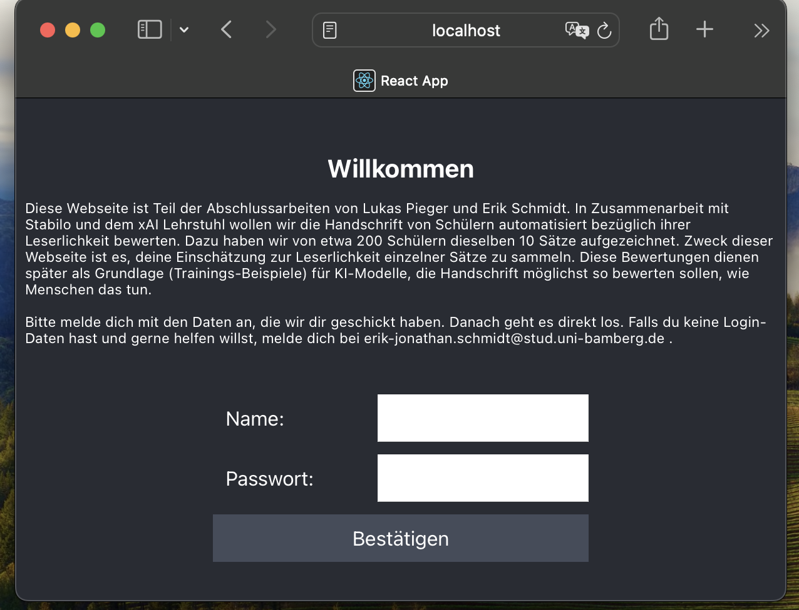
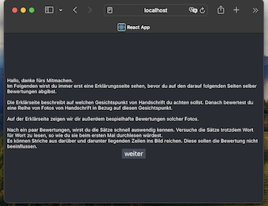

# Handwriting Labeling App Frontend

## What is this project for?
This is the React frontend of the Handwriting Labeling App.
This app servers to collect labels on handwriting legibility from annotators.
This project is part of research in the direction of automatic handwriting assessment.
It was developed by Aaron Lukas Pieger and Erik Jonathan Schmidt as part of our Master Theis projects.

## Functionality of the app

### Annotators
Annotators use the UI of the web app.
The admin needs to creat an account with credentials (username + password) for each user.
The UI is in German.

**login**  
Page where users login with their credentials

**welcome**
Welcome page with instructions to user

**introduction**
Page that explains the annotation task

**labeling**
Page to collect label on one sample

**outro**
Page that prepares the user for next annotation task in line

### Admin