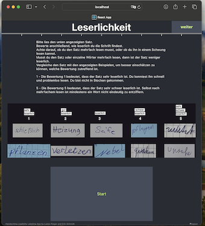
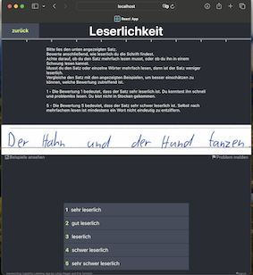

# Handwriting Labeling App Frontend

## What is this project for?
This is the React frontend of the Handwriting Labeling App.
This app servers to collect labels on handwriting legibility from annotators.
This project is part of research in the direction of automatic handwriting assessment.
It was developed by Aaron Lukas Pieger and Erik Jonathan Schmidt as part of our Master Theis projects.

## Functionality of the app
This app was developed to carry out the data labeling for a handwriting legibility dataset.
We collect scores from "very good" 1 to "very bad" 5 for four questions about the legibility of
handwritten sentences. The web app provides authentication with the user system in the backend.
After login the web app provides UI to carry out the labeling task.
All admin functionality is implemented in the backend only.

### Annotator UI
Annotators use the UI of the web app.
The admin needs to creat an account with credentials (username + password) for each user.
The UI is in German.

**login**  
Page where users login with their credentials  

**welcome**
Welcome page with instructions to user  

**introduction**  
Page that explains the annotation task  

**labeling**  
Page to collect label on one displayed sample  

**outro**
A page that appears after finishing a batch of tasks.

### Backend
This react frontend works with the spring backend application
[handwriting-labeling-app-backend](https://github.com/LukasPieger1/handwriting-labeling-app-backend)

## How to run
1. Setup project and make sure env variables are provided.
2. Verify backend is running.
3. Run react frontend.
### Setup
The backend url is specified as environment variable in .env which is excluded from git.
The [provide-defaults](provide-defaults.sh) creates the .env file locally if not available and sets the backend
root url to REACT_APP_BACKEND_URL_ROOT=http://localhost:8080 as default.

### Verify backend is running
For explanation on how to run the backend go to the linked [repository]((https://github.com/LukasPieger1/handwriting-labeling-app-backend)
).

### Run React Frontend
From within the working directory _/handwriting-labeling-app-frontend_ run  
`npm install`  
to install dependencies from [package.json](package.json).  

Once dependencies are installed and the backend is up and running run  
`npm run`  
The web app should show up in your browser.

